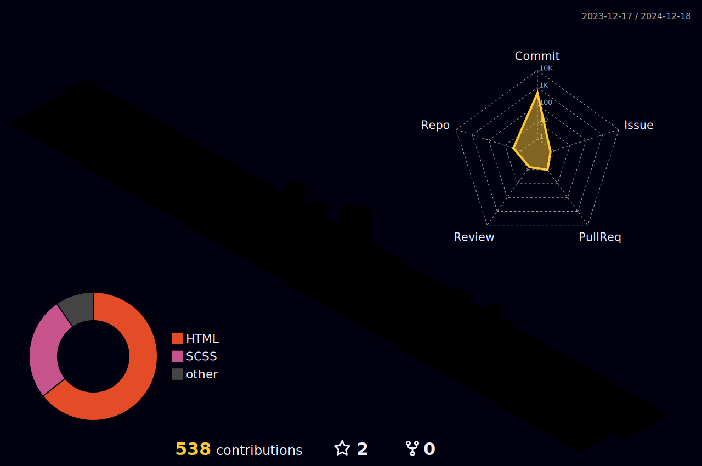

# Profile

 

## About me

Nothing much to tell. I do stuff like developing usefull apps for your everyday tasks and did develop discord bots for fun and/or boredom.

Some stuff i use:

 |                                                                             Python3                                                                              |                                                                           C#                                                                            |                                                                                  Node.js                                                                                   |                                                                             Git                                                                              |                                                                                   Javascript                                                                                    |                                                                         XML                                                                         |                                                                                        WinForms                                                                                        |                                                                      WinUI3                                                                       |                                                                      MDI                                                                      |                                                                                                     DevIcon                                                                                                     |                                                                                VS                                                                                |                                                                                   VSCode                                                                                    |                                                                                 Win10                                                                                  |                                                                                                   Win11                                                                                                    |
 | :--------------------------------------------------------------------------------------------------------------------------------------------------------------: | :-----------------------------------------------------------------------------------------------------------------------------------------------------: | :------------------------------------------------------------------------------------------------------------------------------------------------------------------------: | :----------------------------------------------------------------------------------------------------------------------------------------------------------: | :-----------------------------------------------------------------------------------------------------------------------------------------------------------------------------: | :-------------------------------------------------------------------------------------------------------------------------------------------------: | :------------------------------------------------------------------------------------------------------------------------------------------------------------------------------------: | :-----------------------------------------------------------------------------------------------------------------------------------------------: | :-------------------------------------------------------------------------------------------------------------------------------------------: | :-------------------------------------------------------------------------------------------------------------------------------------------------------------------------------------------------------------: | :--------------------------------------------------------------------------------------------------------------------------------------------------------------: | :-------------------------------------------------------------------------------------------------------------------------------------------------------------------------: | :--------------------------------------------------------------------------------------------------------------------------------------------------------------------: | :--------------------------------------------------------------------------------------------------------------------------------------------------------------------------------------------------------: |
 |  |  |  |  |  |  |  |  |  |  |  |  |  |  |

## Stats

  
  

  <a href="">

 <a href="">

